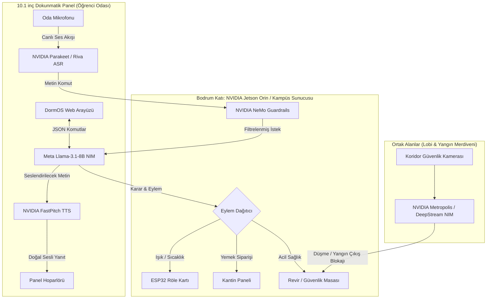

# 🧠 NVIDIA NIM & Edge AI Entegrasyon Şartnamesi
> **Proje:** DormOS - Akıllı Yurt ve Kampüs Yaşam Ekosistemi  
> **Platform:** [build.nvidia.com](https://build.nvidia.com)  
> **Donanım Hedefi:** NVIDIA Jetson Orin Nano / Orin NX (Bodrum Katı & Kat Panoları) + 10.1" PoE Paneller

---

## 1. 📋 `build.nvidia.com` Üzerinden Seçeceğiniz Tam AI Model Listesi

`build.nvidia.com` sitesinde arama kutusuna (Search) yazıp seçeceğiniz **birebir tam isimler** şunlardır:

```
+-------------------------------------------------------------------------------------------------------+
| KATEGORİ            | `build.nvidia.com` ÜZERİNDEKİ TAM MODEL ADI          | DORMOS'TAKİ GÖREVİ               |
+-------------------------------------------------------------------------------------------------------+
| 🎙️ 1. Ses Tanıma   | `nvidia/parakeet-ctc-1.1b-riva`                       | Öğrencinin konuşmasını anında    |
|    (Speech-to-Text) | veya `openai/whisper-large-v3`                        | metne ve komuta çevirir (ASR).   |
+---------------------+-------------------------------------------------------+----------------------------------+
| 🗣️ 2. Ses Üretme    | `nvidia/riva-tts-fastpitch-hifigan`                   | Sistemin öğrenciye Türkçe/İng    |
|    (Text-to-Speech) |                                                       | doğal insan sesiyle yanıt vermesi|
+---------------------+-------------------------------------------------------+----------------------------------+
| 🧠 3. Akıllı Beyin  | `meta/llama-3.1-8b-instruct` (Uçta Jetson İçin)       | Yurt asistanı, menü siparişi,    |
|    (LLM Asistan)    | veya `meta/llama-3.1-70b-instruct` (Kampüs Sunucusu)  | rehberlik ve genel karar motoru. |
+---------------------+-------------------------------------------------------+----------------------------------+
| 🛡️ 4. AI Güvenlik  | `nvidia/nemo-guardrails`                              | Tıbbi ve psikolojik konularda    |
|    (Güvenlik Filt)  |                                                       | yanlış/zararlı yanıtları engeller|
+---------------------+-------------------------------------------------------+----------------------------------+
| 👁️ 5. Koridor Video | `nvidia/tao-peoplenet`                                 | Koridorda bayılma/düşme ve       |
|    (Metropolis AI)  | veya `nvidia/deepstream`                              | yangın merdiveni blokaj tespiti. |
+---------------------+-------------------------------------------------------+----------------------------------+
```

---

## 2. 🏗️ NVIDIA NIM & Jetson Mimari Şeması



---

## 3. 🔑 NVIDIA API Anahtarı (API Key) Nasıl Alınır?

1. **[build.nvidia.com](https://build.nvidia.com)** sitesine gidin.
2. Sağ üstteki **"Sign In / Create Account"** ile ücretsiz NVIDIA Developer hesabı açın.
3. Yukarıdaki modellerden birini (örneğin `meta/llama-3.1-8b-instruct`) seçin.
4. Sağ üstteki yeşil **"Get API Key"** butonuna tıklayın.
5. Size verilen `nvapi-...` ile başlayan anahtarı kopyalayın.

---

## 4. 🐳 Sunucuda Tek Komutla Çalıştırma (Docker NIM Deployment)

Yurdun yerel sunucusunda veya Jetson kartında bu modeli çalıştırmak için terminale tek bir Docker komutu yazılır:

```bash
# Llama-3.1 NIM Modelini Yerel Olarak Başlatma
export NGC_API_KEY="nvapi-SIZIN_NVIDIA_ANAHTARINIZ"

docker run -d --name dormos-nvidia-brain \
  --gpus all \
  -e NGC_API_KEY=$NGC_API_KEY \
  -p 8000:8000 \
  nvcr.io/nim/meta/llama-3.1-8b-instruct:latest
```

---

## 5. 💡 Desteklenen Sesli Komut Örnekleri

* 💡 *"DormOS, ışıkları aç / kapat"* ➔ ESP32 rölesi doğrudan tetiklenir.
* 🍲 *"DormOS, hastayım sıcak mercimek çorbası siparişi ver"* ➔ Hasta menüsü otomatik seçilip mutfağa iletilir.
* 🌡️ *"Oda sıcaklığı ve nem durumu nedir?"* ➔ DHT22 canlı sensör verisi doğal Türkçe sesle okunur.
* 🚑 *"Acil durum, revire haber ver!"* ➔ 15 sn teyit olmadan doğrudan acil sağlık protokolü başlatılır.
