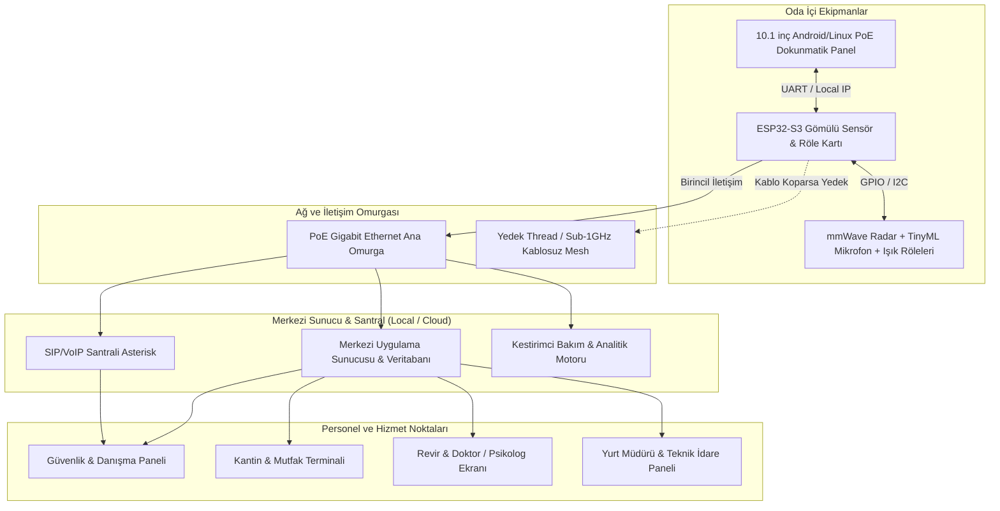

# 🏢 DormOS: Akıllı Yurt ve Kampüs Yaşam Ekosistemi
> **Kapsamlı Proje Dokümantasyonu, Seviye & Fizibilite Analizi ve Faz Yol Haritası**

---

## 📑 İÇİNDEKİLER
1. [Proje Tanımı ve Vizyon](#1-proje-tanımı-ve-vizyon)
2. [Projenin Seviyesi ve "Oluru" (Fizibilite & Pazar Analizi)](#2-projenin-seviyesi-ve-oluru)
3. [Faz Aşamaları (Ayrıntılı Yol Haritası)](#3-faz-aşamaları-ayrıntılı-yol-haritası)
4. [Hemen Yapılacaklar (Çekirdek Kapsam - Core Scope)](#4-hemen-yapılacaklar-çekirdek-kapsam)
5. [Daha Sonra Eklenecekler (İleri Seviye Backlog)](#5-daha-sonra-eklenecekler-ileri-seviye-backlog)
6. [Sistem Mimarisi ve İletişim Akışı](#6-sistem-mimarisi-ve-iletişim-akışı)
7. [Kritik Mühendislik Zorlukları ve Çözümleri](#7-kritik-mühendislik-zorlukları-ve-çözümleri)

---

## 1. Proje Tanımı ve Vizyon

**DormOS**, KYK ve üniversite yurtlarındaki dağınık, manuel ve verimsiz süreçleri (diyafon, güvenlik, kantin/yemekhane, revir, kargo/kurye lojistiği, enerji ve bakım yönetimi) tek bir **10.1 inç Akıllı Duvar Paneli** ve **Merkezi Yönetim Yazılımı** altında birleştiren, **Uçta Yapay Zeka (Edge AI)** ve **Çökmez Ağ (Fail-Safe Mesh)** destekli yeni nesil bir bina/yaşam işletim sistemidir.

### Temel Hedefler:
* **Öğrenci Deneyimi:** Oda içi konfor, hızlı kargo teslimatı, kantin siparişi, revir/psikolojik destek ve güvenli acil durum iletişimi.
* **Yurt İdaresi & Güvenlik:** Tek ekrandan anlık bina durumu, kestirimci arıza tespiti (su/elektrik kaçakları), merkezi anons ve acil durum triyajı.
* **Operasyonel Verimlilik:** Enerji tasarrufu, sıfır kargo bekleme süresi, gereksiz personel iş yükünün ortadan kaldırılması.

---

## 2. Projenin Seviyesi ve "Oluru"

### 🎯 Projenin Teknik Seviyesi: **İleri Düzey Ar-Ge & Girişim (Startup) Seviyesi (8.5 / 10)**
Bu proje sıradan bir hobi/Arduino projesi değil; **Donanım (Gömülü Sistemler)**, **Telekomünikasyon (VoIP/SIP)**, **Yapay Zeka (TinyML & Kestirimci Analitik)** ve **Tam Kapsamlı Yazılım (Full-Stack)** disiplinlerini bir araya getiren bir **Endüstriyel PropTech (Mülk Teknolojisi)** ekosistemidir.

### 📊 "Oluru" Nedir? (Fizibilite Analizi):
1. **Teknik Olarak Yapılabilir mi?**
   * **Evet.** Kullanılacak tüm donanım ve yazılım bileşenleri (Rockchip/ARM paneller, ESP32-S3, Asterisk SIP santrali, Thread/ESP-Mesh protokolleri, TinyML ses sınıflandırma ve mmWave radarları) günümüz teknolojisinde mevcuttur ve erişilebilirdir.
2. **Pazar İhtiyacı ve Ticari Değeri:**
   * Türkiye'de 800+ KYK yurdu, yüzlerce özel üniversite yurdu ve yüz binlerce yurt odası bulunmaktadır.
   * Dünyada ise üniversite konaklama pazarı yüz milyarlarca dolarlık bir hacme sahiptir.
   * Yurt yönetimlerinin en büyük 3 gideri: **Enerji israfı**, **Güvenlik/Operasyon personeli maliyeti** ve **Arıza/Bakım gecikmeleridir**. Bu proje doğrudan bu 3 maliyeti düşürdüğü için B2B / B2G satışı çok yüksek bir üründür.
3. **Neden "MIT / Küresel İnovasyon" Seviyesinde?**
   * Pazardaki mevcut sistemler (diyafonlar, akıllı kilitler) birbirinden bağımsız kapalı kutulardır.
   * Bu projeyi küresel seviyeye taşıyan 4 özgün Ar-Ge unsuru vardır:
     1. **Kamerasız Sağlık/Yaşam Takibi (mmWave Radar):** Gizlilik ihlali yapmadan nefes/düşme/varlık tespiti.
     2. **Uçta Ses Analizi (Edge TinyML):** Ses kaydını dışarı aktarmadan çığlık/cam kırılması tespiti + sahte alarm doğrulama algoritması.
     3. **Çökmez Hibrit Ağ:** İnternet ve ana kablolar kopsa dahi çalışan radyo dalgası (Mesh) acil durum hattı.
     4. **Kestirimci Bakım:** Sayaç verilerinden boru sızıntısı ve elektrik ark hatası tespiti.

---

## 3. Faz Aşamaları (Ayrıntılı Yol Haritası)

Projeyi başarıyla tamamlamanın tek yolu **kademeli (faz bazlı)** ilerlemektir:

```
[FAZ 1: Çekirdek MVP] ──> [FAZ 2: Yaşam Modülleri] ──> [FAZ 3: Çökmez Ağ] ──> [FAZ 4: Edge AI & Ar-Ge] ──> [FAZ 5: Ürünleşme]
```

### 🔹 FAZ 1: Çekirdek MVP (Temel Donanım + Arayüz + SIP İletişim)
* **Amaç:** Odanın içinde çalışan 1 adet dokunmatik panel, ışık kontrolü ve diğer odaları/güvenliği arayabilen temel sistem.
* **Adımlar:**
  1. 1 adet dokunmatik ekranlı geliştirme ünitesi (Tablet / Raspberry Pi / Android Panel).
  2. Panel üzerinde modern bir kullanıcı arayüzü (Flutter veya Android tabanlı).
  3. Açık kaynak **SIP/VoIP Santrali** (FreePBX / Asterisk) kurulumu.
  4. Panelden güvenliği ve diğer odayı sesli/görüntülü arama testleri.
  5. ESP32 ile röle üzerinden oda ışığı / priz açma-kapama kontrolü.

### 🔹 FAZ 2: Kampüs Yaşam & Operasyon Modülleri
* **Amaç:** Yurdun iç operasyonunu dijitalleştirmek (Yemek, Sağlık, Kargo).
* **Adımlar:**
  1. **Mutfak / Kantin Portalı:** Web tabanlı sipariş yönetim ekranı + Panelden yemek/içecek siparişi verme.
  2. **Revir & İlk Yardım Modülü:** 3 saniyelik acil durum triyaj butonu + "Sessiz Psikolojik Destek" talep akışı + İlaç hatırlatıcı.
  3. **Sürtünmesiz Kurye/Kargo Sistemi:** Giriş kapısı için dinamik PIN / QR kod ile öğrenci panelini çaldırma veya dolap entegrasyonu.
  4. **Yönetim Paneli:** Müdür ve kat sorumluları için merkezi web yönetim arayüzü.

### 🔹 FAZ 3: Dayanıklılık & Ağ Altyapısı (Fail-Safe Mesh)
* **Amaç:** İnternet ve fiziksel kablolar çökse bile sistemin haberleşebilmesi.
* **Adımlar:**
  1. Ana hat için **PoE (Power over Ethernet)** kablolama standardının belirlenmesi.
  2. ESP32-S3 modülleri arasında **ESP-NOW / Thread / Sub-1GHz RF** kablosuz acil durum ağı kurulması.
  3. Ana sunucuya giden Ethernet kablosu kesildiğinde sistemin otomatik olarak radyo mesh ağına geçiş testi (Fault-Tolerance).

### 🔹 FAZ 4: İleri Düzey Ar-Ge & Yapay Zeka (MIT Seviyesi)
* **Amaç:** Sisteme otonom zeka, kaza algılama ve arıza öngörüsü kazandırmak.
* **Adımlar:**
  1. **TinyML Akustik Sınıflandırıcı:** Edge Impulse kullanarak çığlık / cam kırılması seslerini cihaz içinde tanıyan model eğitilmesi.
  2. **Sahte Alarm Filtresi:** 15 saniyelik "İyiyim / PIN Gir" doğrulama ve iptal mekanizması.
  3. **mmWave Radar Entegrasyonu:** 60GHz radar ile kamerasız düşme, nefes ve oda doluluk tespiti.
  4. **Kestirimci Bakım Algoritması:** Su debisi ve elektrik akım dalgalanmalarından sızıntı/ark tespiti yapan Python arka plan servisi.

### 🔹 FAZ 5: Endüstriyelleşme, Donanım Üretimi & Pilot Test
* **Amaç:** Laboratuvar prototipinden seri üretime uygun nihai ticari ürüne geçiş.
* **Adımlar:**
  1. Özel PCB tasarımı (ESP32 + Röleler + Güç koruma devreleri tek bir duvara gömülü kartta).
  2. Endüstriyel 10.1" PoE Android panel tedariği ve kalıp/kasa tasarımı.
  3. Gerçek bir yurt binasında 5-10 odalık pilot saha kurulumu ve dayanıklılık testi.
  4. Patent ve faydalı model başvuruları.

---

## 4. Hemen Yapılacaklar (Çekirdek Kapsam)

Aşağıdaki liste, projenin ilk çalışan prototipini (Faz 1 & Faz 2) ayağa kaldırmak için gereken somut adımlardır:

- [ ] **Sistem Mimarisi ve Teknoloji Seçimi:**
  - Panel Yazılımı: Flutter (Linux/Android uyumlu, ultra akıcı arayüz).
  - Backend API: Node.js / Go / Python FastAPI.
  - Veritabanı: PostgreSQL + Redis (Canlı bildirimler ve durum takibi).
  - VoIP / Santral: Asterisk / Kamailio (SIP protokolü).
- [ ] **Panel Arayüzü (UI/UX) Geliştirme:**
  - Ana Ekran (Saat, Hava Durumu, Oda Sıcaklığı, Hızlı Aydınlatma).
  - Telefon / Diyafon Ekranı (Oda numarası tuşlama, Hızlı Müdür/Güvenlik/112 butonları).
  - Kantin / Mutfak Menüsü Ekranı (Sepete ekle, hasta menüsü seçeneği, sipariş durumu).
  - İlk Yardım & Sağlık Ekranı (Acil Çağrı, Revir İletişimi, Dozaj Takibi).
  - Tüketim & Faturalandırma Ekranı (Oda elektrik ve su tüketim grafiği).
- [ ] **Gömülü Kontrolcü (ESP32) Yazılımı:**
  - MQTT / WebSocket üzerinden panel ile çift yönlü haberleşme.
  - Işık ve priz rölelerinin kontrolü.
  - Sıcaklık, nem ve temel sensör verilerinin panele aktarılması.
- [ ] **Merkezi Yönetim Web Paneli:**
  - Yurt Müdürü / Güvenlik Görevlisi ekranı (Gelen çağrılar, acil durum uyarıları).
  - Kantin Görevlisi ekranı (Gelen siparişler, hazırlık durumu).
  - Revir / Sağlıkçı ekranı (Gelen sağlık çağrıları, hasta öğrenci listesi).

---

## 5. Daha Sonra Eklenecekler (İleri Seviye Backlog)

Bu özellikler Faz 3 ve Faz 4'te projeyi küresel rekabete açacak katmanlardır:

- [ ] **Edge AI Ses Sınıflandırma (TinyML):** Ses kaydı dışarı sızmadan mikroişlemci üzerinde acil seslerin analizi.
- [ ] **Kamerasız mmWave Radar Entegrasyonu:** 60GHz radar ile odada uyku kalitesi, düşme ve hareketsizlik tespiti.
- [ ] **Thread / ESP-NOW Çökmez Kablosuz Mesh Altyapısı:** Ana omurga kopsa dahi paketlerin odadan odaya atlayarak ana merkeze ulaşması.
- [ ] **Kestirimci Bakım & Anomali Motoru:** Makine öğrenmesi ile boru patlağı, açık unutulan musluk veya rezistans arızalarının faturaya yansımadan önce yakalanması.
- [ ] **Dinamik Kurye QR / Akıllı Dolap (Locker) Entegrasyonu:** Kuryenin kapıda beklemesini sıfıra indiren otonom teslimat protokolü.
- [ ] **Çoklu Alerjen & Çölyak Uyarı Motoru:** Kantin menüsünde öğrencinin sağlık profiline göre otomatik filtreleme.
- [ ] **KVKK & Sıfır Bilgi Güvenlik Katmanı (Zero-Knowledge):** Oda içi sağlık ve varlık verilerinin sadece acil durumda şifresinin çözülmesi.

---

## 6. Sistem Mimarisi ve İletişim Akışı



---

## 7. Kritik Mühendislik Zorlukları ve Çözümleri

| Zorluk / Problem | Olası Risk | Mühendislik Çözümü |
| :--- | :--- | :--- |
| **Kablo Kopması / Fare / Fiziksel Hasar** | Panellerin merkeze ulaşamaması, acil durumun iletilememesi. | **Hibrit İletişim:** Normalde PoE Ethernet, hat kesilirse Sub-1GHz / Thread kablosuz Mesh üzerinden veri atlatma. |
| **Sahte Çığlık / Gürültü Alarmı (Rüya, Oyun, Böcek)** | Güvenlik veya 112'nin gereksiz odaya gelmesi. | **Multi-Modal Doğrulama:** TinyML ses tespiti sonrası ekranda 15 sn geri sayım + "İyiyim" butonu + mmWave radar ile hareket kontrolü. |
| **Gizlilik / Mahremiyet Kaygıları (KVKK)** | Öğrencilerin odalarında izlendiklerini hissetmeleri. | **Sıfır Kamera Politikası:** Görüntü işleme yerine mmWave radar; ses kaydı tutulmadan tamamen cihaz içinde (Edge) çalışan sınıflandırıcılar. |
| **Kırmızı Reçeteli İlaç & Sağlık Mevzuatı** | Yasal sorumluluk ve yanlış ilaç teslimi. | **Zimmetli Doğrulama:** İlaçlar asla kurye ile bırakılmaz; panel üzerinden revir randevusu ve hekim gözetiminde PIN/NFC ile teslimat akışı. |
| **Büyük Ekran Maliyeti & Isınma** | Tabletlerin 7/24 duvarda açık kalması sonucu pil şişmesi/arıza. | **Pilsiz Endüstriyel PoE Paneller:** Bataryasız, doğrudan Ethernet hattından beslenen, duvara gömme metal soğutmalı paneller. |

---
*Doküman Sürümü: v1.0.0 — Proje Başlangıç ve Yol Haritası Şartnamesi*
